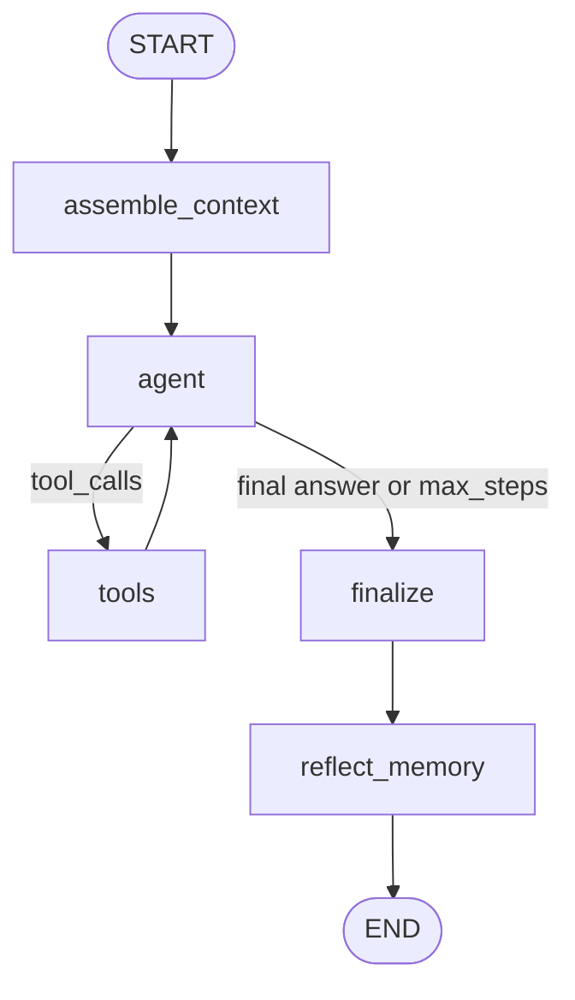

# Architecture (Phase 6)

**Nodes**

1. `assemble_context` — system + scratchpad, optional LTM recall, STM history, user task  
2. `agent` — native tool-calling LLM step  
3. `tools` — harness executes tools and appends observations  
4. `finalize` — records answer / stop reason  
5. `reflect_memory` — optional 0–3 durable writes with dedup (memory mode only)

**Baselines (`AGENT_MODE`)**

| Mode | Alias | Behavior |
|------|-------|----------|
| `stateless` | B0 | no STM history, no LTM tools/injection, no reflection |
| `full_history` | B1 | STM `full` (append-all), no LTM |
| `memory` | B2 | bounded STM + LTM + reflection |

**Checkpointer:** SQLite at `CHECKPOINT_PATH` (LangGraph `SqliteSaver`). `thread_id` = `session_id`.

**Backends:** `AGENT_BACKEND=graph` (default) or `loop` (pre-LangGraph ReAct loop).
